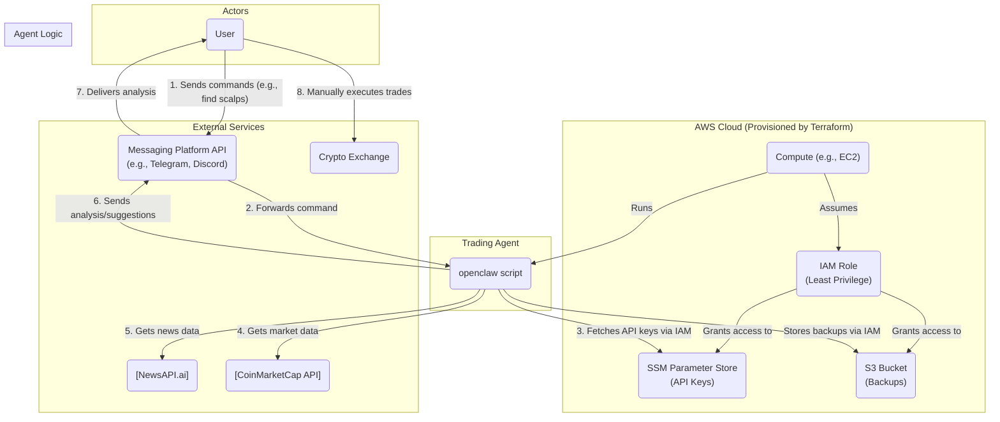

# crypto_analytic

This project is a low-risk automated agent for spot trading cryptocurrencies. It aims to achieve slow but consistent capital growth by making informed trades based on data from CoinMarketCap and the latest news.

## Architecture Diagram

The diagram below outlines the infrastructure and data flow for the `openclaw` agent.



### Agent Mindset

The core philosophy of this agent is to operate with a **low-risk profile**. It is not designed for high-frequency trading or chasing speculative rallies. Instead, it focuses on:

- **Consistency**: Making small, regular trades.
- **Data-Driven Suggestions**: Providing analysis based on market indicators from CoinMarketCap and sentiment from news sources to support user decisions.
- **Capital Preservation**: Prioritizing slow and steady growth over risky, high-reward strategies.

### Agent Context & Knowledge Sharing

It is important to understand that this repository contains the core, shareable logic for the agent, but not its full operational context (e.g., memory, specific lessons learned from individual trades).

- **Separation of Concerns**: The agent's dynamic "mindset" and experience are stored in backups on S3, not in this Git repository. This keeps the codebase clean and focused on the agent's fundamental capabilities.
- **Collaborative Knowledge**: A key future goal is to enable knowledge sharing between different users' agents. For example, `lessons_learned.md` files from multiple users, so it can be merged. By combining diverse experiences, the agent's understanding of the market becomes more robust and sophisticated over time.

This model allows for both personalized agent growth and community-driven intelligence.

## Getting Started

This guide provides the steps to get your own `openclaw` agent running. While an example using AWS and Terraform is provided, the agent is designed to be platform-agnostic and can be deployed on any server or cloud provider.

### 1. Prerequisites

Before you begin, ensure you have the following:

*   **A Server/Compute Environment**: A place to run the agent, such as a personal server, a virtual machine, or a cloud instance (e.g., AWS EC2, GCP Compute Engine).
*   **Python 3**: The agent is written in Python and has been tested with Python 3.8.
*   **Messaging Platform Bot**: A bot for your preferred messaging service (e.g., Slack, Discord) to communicate with the agent. You will need its API token.
*   **API Keys**:
    *   **NewsAPIAI**: For fetching news data.
    *   **CoinMarketCap**: For fetching cryptocurrency market data.

### 2. Configuration: Managing Secrets

The agent needs secure access to your API keys. Obviously, they should **never** be hardcoded in the source code. The recommended approach is to use some sort of a secret manager.
#### Example: Using AWS SSM Parameter Store

If you are deploying on AWS, you can store the API keys as encrypted `SecureString` parameters in the AWS Systems Manager (SSM) Parameter Store. The agent's IAM role will allow it to securely fetch them at runtime.

Use the AWS CLI to store your secrets:
```bash
# Replace placeholders with your actual API keys/tokens
aws ssm put-parameter --name "/crypto/api/messaging_token" --value "YOUR_MESSAGING_BOT_TOKEN" --type SecureString
aws ssm put-parameter --name "/crypto/api/newsapi" --value "YOUR_NEWSAPI_KEY" --type SecureString
aws ssm put-parameter --name "/crypto/api/coinmarketcap" --value "YOUR_COINMARKETCAP_KEY" --type SecureString
```

### 3. Deployment

You need to run the `openclaw` script on your chosen server.

#### Example: Deploying on AWS EC2 with Terraform

This repository includes a Terraform configuration to provision the entire infrastructure on AWS. This is the quickest way to get started if you are using AWS.

1.  Navigate to the EC2 environment directory: `cd terraform/env/ec2`
2.  Initialize Terraform: `terraform init`
3.  Review the plan and apply the configuration: `terraform apply`

This will create the EC2 instance, IAM roles, and other necessary resources as defined in the architecture diagram. The `user_data` script will bootstrap the agent on the instance.
